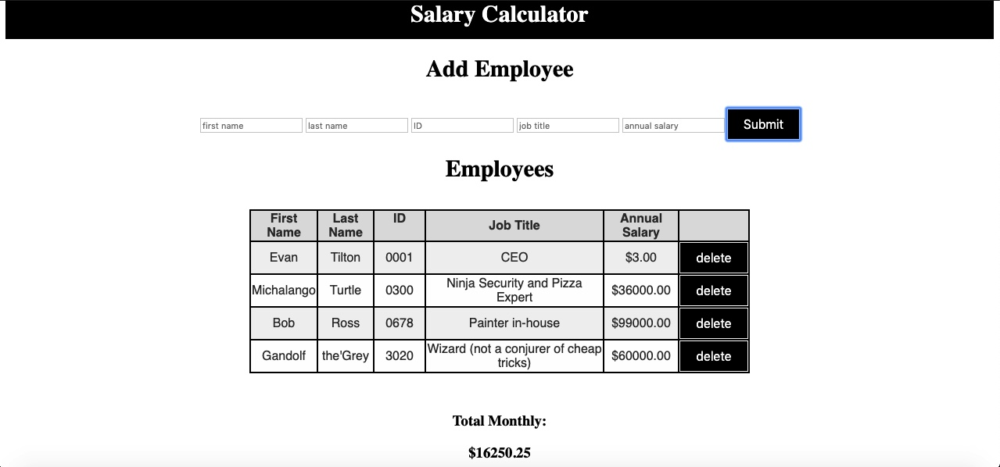

# Jquery-Salary-Calculator

## Description
Duration: Weekend

    This application is for a user to keep track of employees and monthly budget.  It allows the user to input the employees first and last name, ID number, job title, and annual salary.  It assumes $20,000 is the monthly alloted budget and informs the user if the they have gone over that budget.  It also allows the user to delete the inputed employee (off of Employee ID) and properly tracks that current budget after the employee is deleted.

    To see the fully functional site, please visit: https://github.com/Evantilton/jquery-salary-calculator

## Screen Shot

## Prerequisites
    Node.js

## Installation
    fork and clone the repo
    open index.html
## Usage

1. Follow the steps in installation.
2. Fill in each input box for the employee.
3. Click submit.
4. If needed or overbudget, used the delete button to remove an employee.

## Built With
    html
    js
    Jquery
    css

## License
    MIT

## Support
    If you have suggestions or issues, please email me at Evantilton@gmail.com
